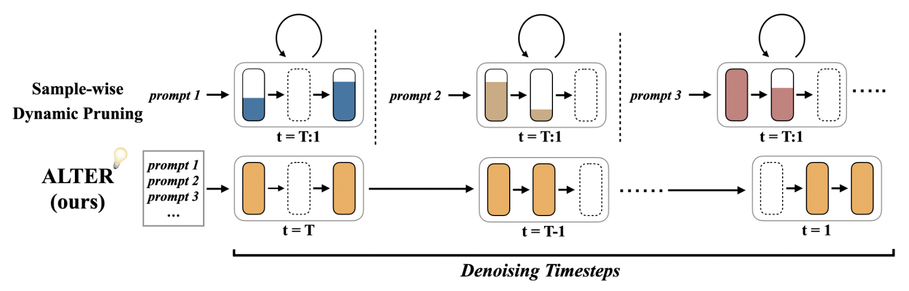
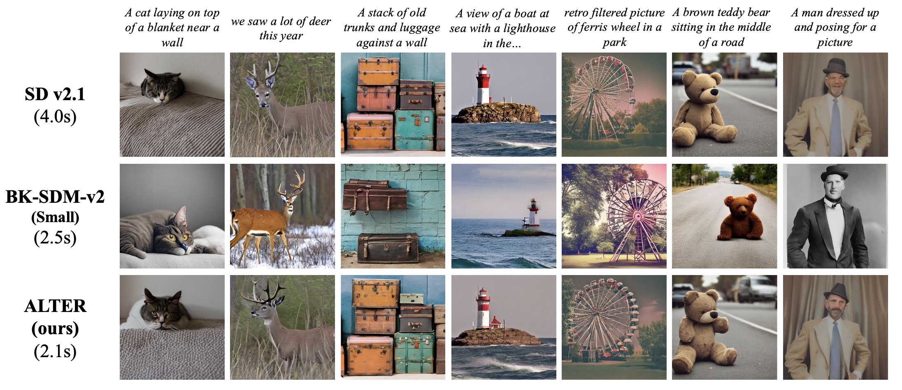
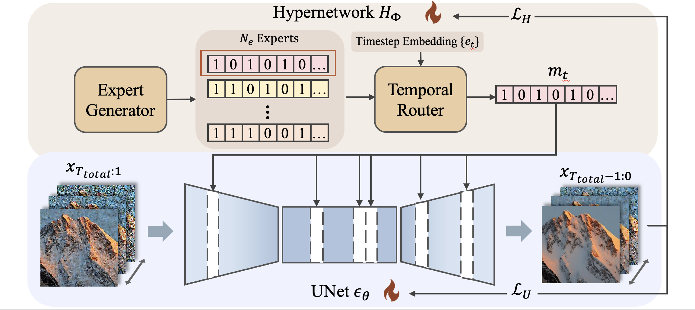
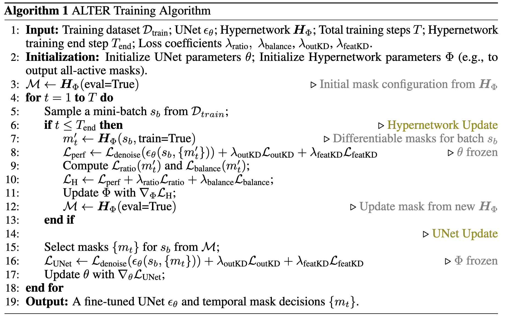

# ALTER: All-in-One Layer Pruning and Temporal Expert Routing for Efficient Diffusion Generation (NeurIPS 2025)

This repository contains the official implementation of [**ALTER**](https://openreview.net/forum?id=021PIPyOU1), a unified framework that transforms diffusion models into a mixture of efficient **temporal experts** via layer-wise pruning and timestep-aware routing. ALTER jointly optimizes pruning masks, routing, and model weights in a single stage, significantly reducing computation while preserving image quality.

---

## 1. Highlights




- **Unified acceleration framework.** ALTER performs **single-stage co-optimization** of layer pruning, temporal expert routing, and model fine-tuning using a trainable hypernetwork. 
- **Temporal experts instead of static pruning.** Different denoising timesteps are routed to specialized pruned subnetworks, allowing the model to use *more* capacity when needed and *less* when it is redundant. 
- **Strong efficiency–quality trade-off.** On Stable Diffusion v2.1, ALTER achieves up to **3.64× speedup** with about **35% sparsity**, while maintaining comparable generative quality to the original model. It also generalizes to transformer-based backbones such as **DiT-XL/2**. 

---

## 2. Method Pipeline



ALTER consists of:

- A **shared diffusion backbone** (UNet for Stable Diffusion v2.1, or DiT-XL/2 for ImageNet).
- A **hypernetwork** that generates:
  - **Expert pruning masks** (layer-wise binary masks defining subnetworks).
  - A **temporal router** that maps timesteps to experts.
- A **differentiable pruning simulator**, which skips layers according to the mask while keeping gradients flowing via straight-through estimators.



During training, ALTER alternates between:
1. **Hypernetwork update:** optimize pruning masks and routing under performance, sparsity, and balance losses.
2. **Backbone update:** train the pruned subnetworks under denoising and optional distillation losses.

See the paper for details.

---

## 3. Environment Setup

### 3.1 Dependencies

The experimental environment relies on Python 3.10 and PyTorch 2.2.1 with CUDA 12.1. The required dependencies can be installed using the following command:
```pip install -r requirements.txt```

## 4. Run Experiments
### 4.1 UNet: Stable Diffusion v2.1
```bash train_sd21.sh```

### 4.2 DiT: DiT-XL/2 on ImageNet 256×256
```bash train_dit.sh```

## 5. Citation
If you find ALTER useful in your research, please consider citing:
```
@inproceedings{
yang2025alter,
title={{ALTER}: All-in-One Layer Pruning and Temporal Expert Routing for Efficient Diffusion Generation},
author={Xiaomeng Yang and Lei Lu and Qihui Fan and Changdi Yang and Juyi Lin and Yanzhi Wang and Xuan Zhang and Shangqian Gao},
booktitle={The Thirty-ninth Annual Conference on Neural Information Processing Systems},
year={2025},
url={https://openreview.net/forum?id=021PIPyOU1}
}
```
